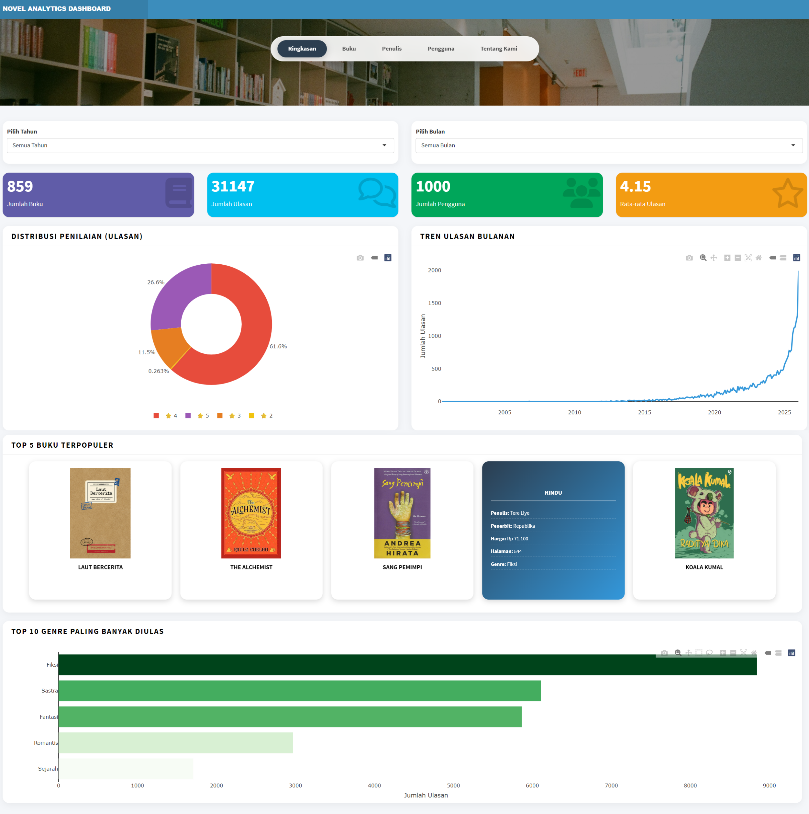
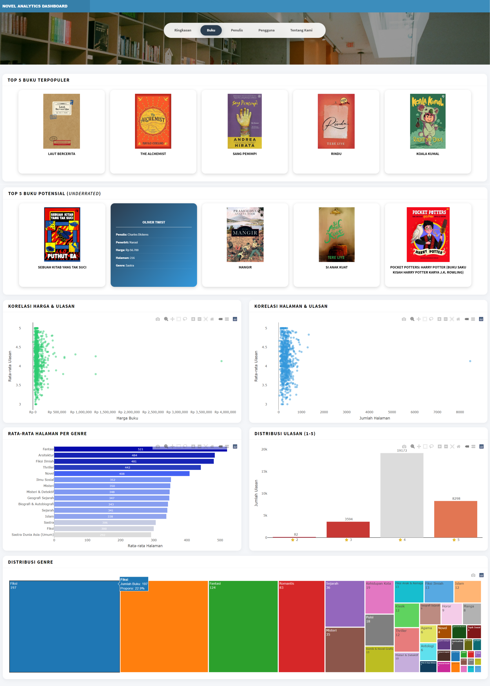
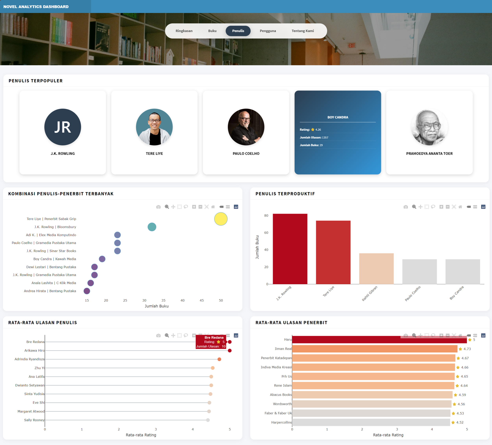
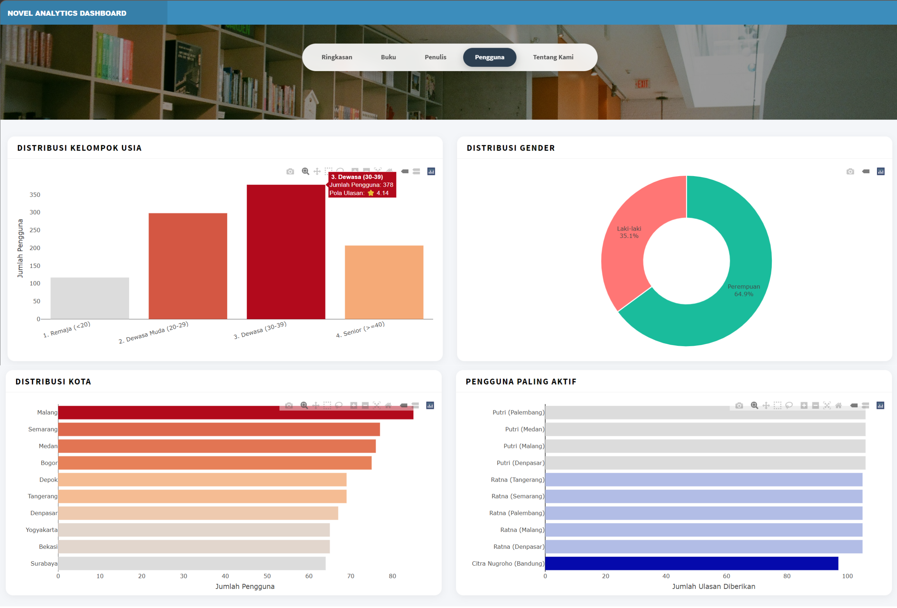
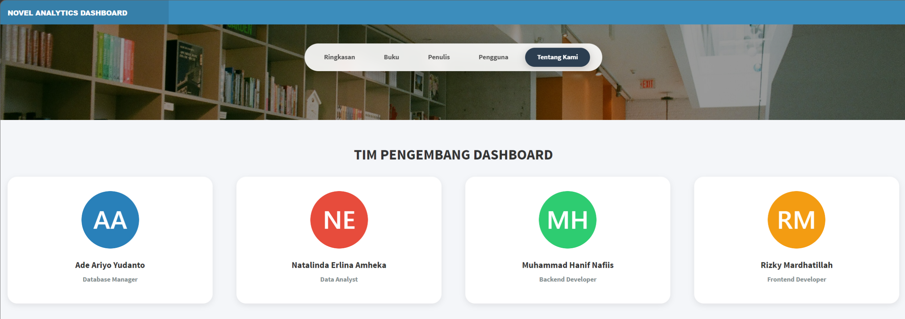

# 📊 Interactive Book Analytics Dashboard

**Mata Kuliah:** Pemrosesan Data Besar (S2 Statistika dan Sains Data, IPB University)  
**Status Proyek:** Aktif/Dalam Pengembangan  

---

## 📖 Latar Belakang
Proyek ini bertujuan untuk merancang dan mengimplementasikan dasbor analitik interaktif berbasis RShiny. Bersumber dari dataset mentah berupa log transaksi ulasan buku e-commerce (format *flat file* tunggal), kami melakukan transformasi arsitektur data secara menyeluruh. Proses ini mencakup pembersihan data, pemodelan basis data relasional, hingga penyajian *insight* bisnis untuk mendukung pengambilan keputusan strategis.

## 👥 Tim Pengembang dan Peran
Proyek kolaboratif ini dikerjakan oleh 4 peran utama dengan spesialisasi masing-masing:
1. **Ade Ariyo Yudanto - Database Manager:** Bertanggung jawab atas perancangan Entity Relationship Diagram (ERD), normalisasi data hingga 3NF, optimasi *raw query*, dan pemeliharaan skema basis data (*Snowflake Schema*).
2. **Natalinda Elina Amheka - Data Analyst:** Bertanggung jawab atas proses ETL, *Exploratory Data Analysis* (EDA), pembersihan data awal, dan penentuan metrik bisnis.
3. **Muhammad Hanif Nafiis - Backend Developer:** Bertanggung jawab merancang logika *server* (RShiny), integrasi koneksi basis data MySQL ke R, dan pemrosesan *query* dinamis.
4. **Rizky Mardhatillah - Frontend Developer:** Bertanggung jawab merancang antarmuka pengguna (UI) RShiny, tata letak dasbor, dan elemen visual yang interaktif.

## ⚙️ Alur Kerja Proyek (Pipeline)
* **Fase 1 - Data Preprocessing & Diagnosis:** <br>
   Identifikasi anomali data mentah (seperti isu ISBN *dummy* dan redundansi atribut penulis/penerbit). <br>
* **Fase 2: Database Architecture:** <br>
   Penerapan normalisasi tingkat tiga (3NF) dan pembentukan *Snowflake Schema* untuk memisahkan entitas *Master* (Buku, Penulis, Penerbit, Pengguna) dan tabel *Fakta* (Ulasan). <br>
* **Fase 3: Query Optimization:** <br>
   Penyusunan sintaks SQL murni dengan memanfaatkan `LEFT JOIN` dan penanganan *Missing Values* (`COALESCE`) untuk menjaga integritas perhitungan analitik. <br>
* **Fase 4: Dashboard Implementation:** <br>
   Visualisasi *insight* data melalui 4 halaman interaktif di RShiny. 

## 📈 Fitur Utama Dasbor
Dasbor dirancang dalam empat halaman utama yang merangkum seluruh wawasan data:

* **A. Ringkasan Umum:** Menampilkan KPI utama (Total Buku, Ulasan, Pengguna, Rating Global) dan tren aktivitas ulasan per bulan.
* **B. Analisis Performa Buku dan Genre:** Menyajikan peringkat 10 buku terpopuler, evaluasi genre, analisis korelasi harga/halaman, dan pemetaan buku potensial (*underrated*).
* **C. Analisis Penulis dan Penerbit:** Mengevaluasi metrik kualitas entitas kreator melalui ulasan terbanyak dan tingkat konsistensi penilaian, serta pasangan kolaborasi penulis-penerbit.
* **D. Analisis Perilaku Pengguna:** Membedah demografi (usia, gender, kota asal) dan distribusi pola penilaian pengguna aktif.

## 📸 Cuplikan Dasbor (Dashboard Previews)

### 1. Menu Ringkasan

> Menampilkan metrik utama performa buku dan tren ulasan secara keseluruhan.

### 2. Menu Buku

> Menyajikan analisis mendalam terkait korelasi metrik buku serta daftar buku terpopuler dan *underrated* yang dibalut dalam efek kartu *3D flip* interaktif.

### 3. Menu Penulis

> Membedah kualitas dan produktivitas penulis maupun penerbit, lengkap dengan *profile card* dinamis untuk penulis dengan ulasan terbanyak.

### 4. Menu Pengguna

> Memvisualisasikan demografi dan pola perilaku pengguna aktif berdasarkan usia, gender, dan lokasi domisili melalui grafik.

### 5. Menu Tentang Kami

> Menampilkan profil ilustratif dari tim pengembang di balik arsitektur data dan pembuatan dasbor analitik ini.

---

## 🛠️ Teknologi yang Digunakan
* **Database:** MySQL/MariaDB
* **Bahasa Pemrograman:** R, SQL
* **Framework Web:** RShiny (shiny, shinydashboard)
* **Visualisasi:** ggplot2, plotly
* **Manajemen Proyek:** Git & GitHub

## 📂 Struktur Repositori
```text
interactive-book-analytics-dashboard/
├── dashboard/                      # Skrip R untuk implementasi Dashboard
│   ├── global.R        
│   ├── ui.R 
│   ├── server.R
│   └── www/                        # Asset statis untuk Shiny (gambar, css, dll)
│       ├── no-cover.png
│       └── hero-banner.jpg        
│
├── data_analysis/                  # Skrip R untuk ETL & Eksplorasi Data
│   ├── ETL_process.R
│   ├── Preprocessing dan EDA Data Novel dan Buku.qmd
│   └── Preprocessing dan EDA Data Novel dan Buku.html
│
├── database/                       # Skrip SQL untuk Skema & Analitik
│   ├── table_schema_metadata.sql   # DDL (Create Table, PK, FK, Constraints)
│   └── queries_dashboard.sql       # Kumpulan Raw Query untuk Dashboard
│
├── dataset/                        # Raw Data
│   └── novel_rawdata.csv      
│
├── docs/                           # Dokumentasi, Desain Konseptual, & Screenshot tampilan dashboard
│   └── screenshot/                        
│       ├── authors-page.png
│       ├── books-page.png
│       ├── overview-page.png
│       ├── team-page.png
│       └── users-page.jpg      
│   ├── ERD Schema.png         
│   ├── ERD_schema_script.txt  
│   ├── KPI Dashboard.pdf      
│   └── Rancangan Dashboard.pdf
│
└── README.md                       # Dokumentasi proyek
